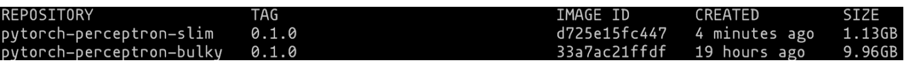
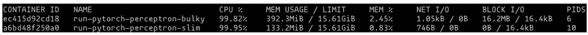

# Training Perceptron using Pytorch with Docker

The purpose of this project is to train a perceptron (code modified from [Natural Language Processing with PyTorch](https://www.oreilly.com/library/view/natural-language-processing/9781491978221/)) using Pytorch with Docker. Moreover, the project is also to demonstrate how to pick a right parent Docker image for your training task.

# Building the Docker image

We can build two Docker images by the Dockerfiles in the root directory. The `Dockerfile_bulky` builds the image from the Pytorch official image `pytorch/pytorch:1.13.1`. The `Dockerfile_slim` builds the image from the miniconda official image `continuumio/miniconda3`. We can build the images by the following commands.

```
docker build -f Dockerfile_slim -t pytorch-perceptron-slim:0.1.0 .
docker build -f Dockerfile_bulky -t pytorch-perceptron-bulky:0.1.0 .
```

# Comparing the image sizes and running time

We can compare the image sizes by the following command. From the image size, we can see that the bulky one is almost 10 times larger than the slim one.

```
docker images | grep pytorch-perceptron
```

<p align="center"></p>

We can run the training task by the following commands. 

```
docker run --rm pytorch-perceptron-slim:0.1.0
docker run --rm pytorch-perceptron-bulky:0.1.0
```

While the training task is running, we can use `docker stats` to see the CPU and memeory usage of the container. We can see that the lightweight container consumes only one-third memory than the bulky one does.

<p align="center"></p>

# Key take aways

This case underscores the significance of crafting a well-structured Dockerfile, particularly in selecting the parent image. In the context of this specific training task, utilizing the PyTorch official image without consideration results in an unnecessarily bulky image, consuming high CPU and memory resources during training. Conversely, building the image from a slim base and adding only essential packages significantly reduces the image size, leading to reduced resource consumption and training time.
